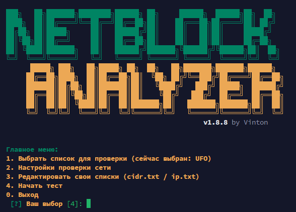

# NetBlock Analyzer



Утилита командной строки для массовой проверки доступности IP-адресов из заданных CIDR-подсетей с определением провайдера (ASN) через whois. Инструмент автоматически пингует несколько IP-адресов из подсети, чтобы найти хотя бы один активный, и собирает результаты в удобную таблицу с возможностью сохранения в CSV.

## Особенности
- **Интерактивный GUI**: Полноценное консольное меню с красивым ASCII-интерфейсом. Работает "из коробки" без дополнительных библиотек.
- **Встроенный редактор**: Возможность редактировать свои личные списки напрямую из программы с помощью `nano` или `vi`.
- **Авто-сохранение настроек**: Конфигурация (скорость, количество потоков, выбор списка) бережно сохраняется в ваш пользовательский профиль `~/.netblock_analyzer.json` и не стирается при обновлениях.
- **Интеллектуальное авто-обновление**: Инструмент сам умеет проверять новые версии на GitHub, обходить кэш и безопасно скачивать обновления. 
- **Эффективность**: Не создает полный список IP-адресов подсети в оперативной памяти — адреса выбираются математически.
- **Многопоточность**: Проверки доступности IP выполняются параллельно с заданным числом потоков.
- **Цветовая индикация**: Использует ANSI-цвета в терминале: живые подсети отмечаются **зеленым**, а мертвые **красным**. Успешные подключения наглядно группируются в конце проверки!

## Требования
- Linux (Debian, Ubuntu, CentOS, RHEL)
- `python3`
- `ping`
- `whois`

*(Скрипт попытается автоматически установить недостающие системные зависимости при запуске из-под root)*

## Установка 

Выполните следующую команду в терминале (подходит как для Linux, так и для Termux на Android):
```bash
curl -sSL https://raw.githubusercontent.com/Vinton777/network-cidr-test-ip/master/install.sh | bash
```

Если утилита `curl` в вашей системе отсутствует или повреждена (например, из-за конфликта зависимостей библиотек в Termux), используйте для установки команду через **Python**:
```bash
python3 -c "import urllib.request, random; req = urllib.request.Request('https://raw.githubusercontent.com/Vinton777/network-cidr-test-ip/master/install.sh?nocache=' + str(random.random()), headers={'User-Agent': 'Mozilla/5.0'}); open('install.sh', 'wb').write(urllib.request.urlopen(req).read())" && bash install.sh && rm install.sh
```

> **Примечание для Linux:** Скрипт устанавливается в `/opt/` и `/usr/local/bin/`. Если вы обычный пользователь (не root), скрипт попросит вас запустить его с правами суперпользователя: `curl ... | sudo bash` (или запустить аналогично через `sudo python3 ...`)

*(Либо вы можете клонировать репозиторий и запускать скрипт `./netblock_analyzer.sh` локально)*

## Использование и меню

Просто введите в терминале:
```bash
netblock_analyzer
```

Вам откроется **Главное меню**:
1. **Выбрать список для проверки** (Свой список, списки облачных провайдеров РФ от Selectel до Reg.ru).
2. **Настройки проверки сети**. Можно изменить количество потоков и тайм-ауты. Настройки навсегда сохранятся.
3. **Редактировать свои списки (cidr.txt / ip.txt)**. Вызывает встроенный редактор, чтобы быстро пополнить свои файлы своими IP-адресами или подсетями.
4. **Автообновление**. Включение или выключение автоматического скачивания и установки новых версий при старте.
5. **Начать тест**. Предложит выбор режима отображения (**Обычный** с выводом каждого пинга, или **Тихий** с компактным выводом таймера и прогресса), а затем запустит многопоточную проверку.

В конце проверки скрипт нарисует красивую итоговую таблицу только из успешных (живых) узлов и сохранит результаты в CSV-файл в папку **Загрузки** (`Downloads`) вашего устройства.

## Особенности работы на Android (Termux)

Если при длительной или массовой проверке в Termux приложение внезапно закрывается с надписью `[Process completed (signal 9) - press Enter]`, это связано с тем, что система Android (начиная с Android 12) принудительно убивает Termux из-за превышения лимитов на запуск дочерних процессов (механизм *Phantom Process Killer*).

### Способы решения:
1. **Через настройки телефона (для Android 14+):**
   Перейдите в **Настройки** $\rightarrow$ **Для разработчиков** $\rightarrow$ включите тумблер **«Отключить ограничения на дочерние процессы»** (*Disable child process restrictions*).
2. **В настройках скрипта:**
   Уменьшите количество потоков. В главном меню выберите пункт `2` (Настройки) $\rightarrow$ установите `Сколько потоков использовать?` в значение `10` или `12` (вместо 20 по умолчанию).
3. **Через ADB (для всех версий Android 12+):**
   Выполните следующие команды через консоль ADB с подключенного ПК для отключения лимитов:
   ```bash
   adb shell "/system/bin/device_config set_sync_disabled_for_tests persistent"
   adb shell "/system/bin/device_config put activity_manager max_phantom_processes 2147483647"
   adb shell settings put global settings_enable_monitor_phantom_procs false
   ```

> [!WARNING]
> **Важно:** Изменение настроек пинга (количество IP и тайм-аут) вы выполняете на свой страх и риск. При агрессивном (timeout < 1) или слишком частом сканировании огромного количества серверов возможны блокировки со стороны целевых сетей или механизмов DDoS защиты вашего провайдера. Автор не ручается за эти настройки и не несет ответственности за возможные последствия. Оставляйте значения по умолчанию, если не уверены.
